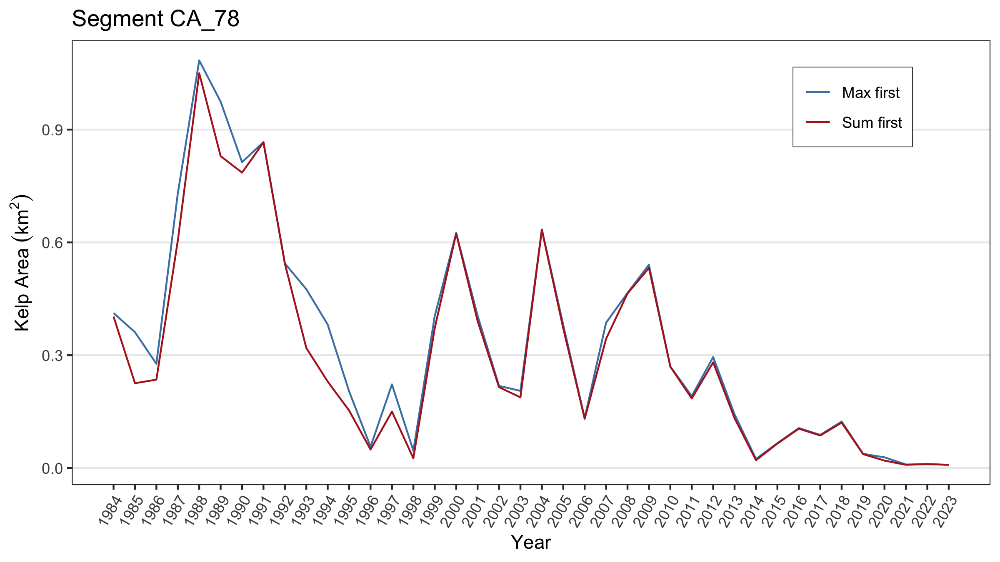

## Data setup and prerequisites

Install the `KelpAreaIndicator` package from the SCCWRP github repository and load it.


``` r
# devtools::install_github("SCCWRP/KelpAreaIndicator")
library(KelpAreaIndicator)
```

Provide the file paths to the Landsat kelp area data, downloaded from the [EDI Data Portal](https://portal.edirepository.org/nis/mapbrowse?scope=knb-lter-sbc&identifier=74), and the shapefile that defines the kelp segment polygons of interest. The kelp segments shapefile is a polygon shapefile with at least one attribute, `Segment_ID`, that defines the kelp area segments of interest.


``` r
lter_file_path <- "../data/LandsatKelpBiomass_2023_Q3_withmetadata.nc"
kelp_segments_file_path <- "../data/uswc_2023_v1"
```

## Assigning segments to Landsat pixels

The `segment_landsat_data()` function will load the Landsat netCDF file and assign each pixel to its respective segment, defined in the kelp segments shapefile. Each pixel in the Landsat data represents a 900 m$^2$ area, so the `segment_landsat_data()` function provides an option to treat the area values as either 0 or 900 m$^2$, rather than the fractional value between 0 and 900, with the `fractional_pixels` parameter. Setting `fractional_pixels = FALSE` will enable this binary treatment of the pixel data.

The resulting data frame consists of rows of pixels from the Landsat data, and columns of quarters for each year of the time series. The `Segment_ID` column indicates which segment that the pixel belongs to. The `lon` and `lat` columns are the longitude and latitude of the pixel, respectively. The remaining columns represent the quarterly kelp area time series of that pixel, in m$^2$.


``` r
segmented_landsat_data <- segment_landsat_data(
  lter_file_path = lter_file_path,
  kelp_segments_file_path = kelp_segments_file_path
)
#> Reading layer `uswc_2023_v1' from data source 
#>   `/Users/nicholasl/Documents/Projects/kelp/KelpAreaIndicator/data/uswc_2023_v1' 
#>   using driver `ESRI Shapefile'
#> Simple feature collection with 360 features and 1 field
#> Geometry type: MULTIPOLYGON
#> Dimension:     XY
#> Bounding box:  xmin: -124.844 ymin: 32.50006 xmax: -117.1239 ymax: 48.42642
#> Geodetic CRS:  WGS 84

segmented_landsat_data
#> # A tibble: 368,087 × 162
#>    Segment_ID   lon   lat Q1.1984 Q2.1984 Q3.1984 Q4.1984 Q1.1985 Q2.1985
#>    <chr>      <dbl> <dbl>   <int>   <int>   <int>   <int>   <int>   <int>
#>  1 OR_21      -125.  42.8      NA       0      66      NA      NA       0
#>  2 OR_21      -125.  42.8      NA       0       0      NA      NA       0
#>  3 OR_21      -125.  42.8      NA       0       0      NA       0       0
#>  4 OR_21      -125.  42.8      NA       0     153      NA      NA       0
#>  5 OR_21      -125.  42.8      NA       0       0      NA       0       0
#>  6 OR_21      -125.  42.8      NA       0       0      NA       0       0
#>  7 OR_21      -125.  42.8      NA       0       0      NA       0       0
#>  8 OR_21      -125.  42.8      NA       0       0      NA       0       0
#>  9 OR_21      -125.  42.8      NA       0      60      NA       0       0
#> 10 OR_21      -125.  42.8      NA       0       0      NA       0       0
#> # ℹ 368,077 more rows
#> # ℹ 153 more variables: Q3.1985 <int>, Q4.1985 <int>, Q1.1986 <int>,
#> #   Q2.1986 <int>, Q3.1986 <int>, Q4.1986 <int>, Q1.1987 <int>, Q2.1987 <int>,
#> #   Q3.1987 <int>, Q4.1987 <int>, Q1.1988 <int>, Q2.1988 <int>, Q3.1988 <int>,
#> #   Q4.1988 <int>, Q1.1989 <int>, Q2.1989 <int>, Q3.1989 <int>, Q4.1989 <int>,
#> #   Q1.1990 <int>, Q2.1990 <int>, Q3.1990 <int>, Q4.1990 <int>, Q1.1991 <int>,
#> #   Q2.1991 <int>, Q3.1991 <int>, Q4.1991 <int>, Q1.1992 <int>, …

segmented_landsat_data_whole_pixels <- segment_landsat_data(
  lter_file_path = lter_file_path,
  kelp_segments_file_path = kelp_segments_file_path,
  fractional_pixels = FALSE
)
#> Reading layer `uswc_2023_v1' from data source 
#>   `/Users/nicholasl/Documents/Projects/kelp/KelpAreaIndicator/data/uswc_2023_v1' 
#>   using driver `ESRI Shapefile'
#> Simple feature collection with 360 features and 1 field
#> Geometry type: MULTIPOLYGON
#> Dimension:     XY
#> Bounding box:  xmin: -124.844 ymin: 32.50006 xmax: -117.1239 ymax: 48.42642
#> Geodetic CRS:  WGS 84

segmented_landsat_data_whole_pixels
#> # A tibble: 368,087 × 162
#>    Segment_ID   lon   lat Q1.1984 Q2.1984 Q3.1984 Q4.1984 Q1.1985 Q2.1985
#>    <chr>      <dbl> <dbl>   <dbl>   <dbl>   <dbl>   <dbl>   <dbl>   <dbl>
#>  1 OR_21      -125.  42.8      NA       0     900      NA      NA       0
#>  2 OR_21      -125.  42.8      NA       0       0      NA      NA       0
#>  3 OR_21      -125.  42.8      NA       0       0      NA       0       0
#>  4 OR_21      -125.  42.8      NA       0     900      NA      NA       0
#>  5 OR_21      -125.  42.8      NA       0       0      NA       0       0
#>  6 OR_21      -125.  42.8      NA       0       0      NA       0       0
#>  7 OR_21      -125.  42.8      NA       0       0      NA       0       0
#>  8 OR_21      -125.  42.8      NA       0       0      NA       0       0
#>  9 OR_21      -125.  42.8      NA       0     900      NA       0       0
#> 10 OR_21      -125.  42.8      NA       0       0      NA       0       0
#> # ℹ 368,077 more rows
#> # ℹ 153 more variables: Q3.1985 <dbl>, Q4.1985 <dbl>, Q1.1986 <dbl>,
#> #   Q2.1986 <dbl>, Q3.1986 <dbl>, Q4.1986 <dbl>, Q1.1987 <dbl>, Q2.1987 <dbl>,
#> #   Q3.1987 <dbl>, Q4.1987 <dbl>, Q1.1988 <dbl>, Q2.1988 <dbl>, Q3.1988 <dbl>,
#> #   Q4.1988 <dbl>, Q1.1989 <dbl>, Q2.1989 <dbl>, Q3.1989 <dbl>, Q4.1989 <dbl>,
#> #   Q1.1990 <dbl>, Q2.1990 <dbl>, Q3.1990 <dbl>, Q4.1990 <dbl>, Q1.1991 <dbl>,
#> #   Q2.1991 <dbl>, Q3.1991 <dbl>, Q4.1991 <dbl>, Q1.1992 <dbl>, …
```
If a kelp segment never contains any pixels with kelp coverage, these segments are represented by a single row of `NA` values for the entire time series.

``` r
segmented_landsat_data |>
  dplyr::filter(Segment_ID == "CA_103")
#> # A tibble: 1 × 162
#>   Segment_ID   lon   lat Q1.1984 Q2.1984 Q3.1984 Q4.1984 Q1.1985 Q2.1985 Q3.1985
#>   <chr>      <dbl> <dbl>   <int>   <int>   <int>   <int>   <int>   <int>   <int>
#> 1 CA_103        NA    NA      NA      NA      NA      NA      NA      NA      NA
#> # ℹ 152 more variables: Q4.1985 <int>, Q1.1986 <int>, Q2.1986 <int>,
#> #   Q3.1986 <int>, Q4.1986 <int>, Q1.1987 <int>, Q2.1987 <int>, Q3.1987 <int>,
#> #   Q4.1987 <int>, Q1.1988 <int>, Q2.1988 <int>, Q3.1988 <int>, Q4.1988 <int>,
#> #   Q1.1989 <int>, Q2.1989 <int>, Q3.1989 <int>, Q4.1989 <int>, Q1.1990 <int>,
#> #   Q2.1990 <int>, Q3.1990 <int>, Q4.1990 <int>, Q1.1991 <int>, Q2.1991 <int>,
#> #   Q3.1991 <int>, Q4.1991 <int>, Q1.1992 <int>, Q2.1992 <int>, Q3.1992 <int>,
#> #   Q4.1992 <int>, Q1.1993 <int>, Q2.1993 <int>, Q3.1993 <int>, …
```

## Extracting time series
The quarterly Landsat time series is extracted with the `extract_segment_time_series()` function. This function aggregates the Landsat data per segment, and either the quarterly or annualized time series for each segment can be extracted. A subset of the kelp segments can be extracted using the `segment_id` parameter.

### Quarterly time series
The quarterly time series is aggregated by summing the quarterly area data for all pixels within each segment. The resulting data frame contains 9 columns:

* `Segment_ID`: The ID of the kelp area segment
* `max_occupiable`: The maximum occupiable kelp area for the given segment. This column repeats the same value for all rows in a single kelp area segment
* `historical_med`: The historical (1984-2013) median kelp area for the segment. The median is computed across the annualized kelp area values. This column repeats the same value for all rows in a single kelp area segment
* `quarter`: The quarter in the time series, otherwise not present
* `year`: Year in the time series
* `date`: Date representation of the year/quarter, for simpler plotting
* `area_abs`: Kelp area in absolute magnitude, in km^2
* `area_hist`: Kelp area relative to the historical median, expressed as a percentage
* `area_pct`: Kelp area relative to the maximum occupiable kelp area, expressed as a percentage


``` r
quarterly_ts <- extract_segment_time_series(
  segmented_landsat_data = segmented_landsat_data,
  frequency = "quarterly"
)

quarterly_ts
#> # A tibble: 57,240 × 9
#>    Segment_ID max_occupiable historical_med quarter  year date       area_abs
#>    <chr>               <dbl>          <dbl> <chr>   <dbl> <date>        <dbl>
#>  1 CA_1                0.800       0.000388 Q1       1984 1984-01-01 0       
#>  2 CA_1                0.800       0.000388 Q2       1984 1984-04-01 0.000543
#>  3 CA_1                0.800       0.000388 Q3       1984 1984-07-01 0       
#>  4 CA_1                0.800       0.000388 Q4       1984 1984-10-01 0       
#>  5 CA_1                0.800       0.000388 Q1       1985 1985-01-01 0       
#>  6 CA_1                0.800       0.000388 Q2       1985 1985-04-01 0.00300 
#>  7 CA_1                0.800       0.000388 Q3       1985 1985-07-01 0.00140 
#>  8 CA_1                0.800       0.000388 Q4       1985 1985-10-01 0       
#>  9 CA_1                0.800       0.000388 Q1       1986 1986-01-01 0.0340  
#> 10 CA_1                0.800       0.000388 Q2       1986 1986-04-01 0.00215 
#> # ℹ 57,230 more rows
#> # ℹ 2 more variables: area_hist <dbl>, area_pct <dbl>
```


### Annual time series
We provide several options for annualizing the quarterly Landsat area data, `max_first`, `sum_first`, or extracting a specific quarter each year, discussed below. The annualized time series data frame is identical to the quarterly time series data, except there is no `quarter` column.

Note that the historical median area (`historical_med`) and maximum occupiable area (`max_occupiable`) are given per `Segment_ID` as well, repeated for every row of its time series. The historical median is calculated across the *annualized* values for 1984 to 2013, inclusive. 

The `max_first` annualization method will loop through all Landsat pixels and for each year of the time series, it will select the maximum value that that pixel attained in that year. Then, these maximum values are added together for all pixels in each segment, so that the resulting time series is annual for each kelp segment.

``` r
max_first_annual_ts <- extract_segment_time_series(
  segmented_landsat_data = segmented_landsat_data,
  annualization_method = "max_first"
)

max_first_annual_ts
#> # A tibble: 14,400 × 8
#>    Segment_ID max_occupiable historical_med  year date       area_abs area_hist
#>    <chr>               <dbl>          <dbl> <dbl> <date>        <dbl>     <dbl>
#>  1 CA_1                0.800        0.00509  1984 1984-01-01 0.000543      10.7
#>  2 CA_1                0.800        0.00509  1985 1985-01-01 0.00434       85.3
#>  3 CA_1                0.800        0.00509  1986 1986-01-01 0.0850      1671. 
#>  4 CA_1                0.800        0.00509  1987 1987-01-01 0.0912      1793. 
#>  5 CA_1                0.800        0.00509  1988 1988-01-01 0              0  
#>  6 CA_1                0.800        0.00509  1989 1989-01-01 0.0163       320. 
#>  7 CA_1                0.800        0.00509  1990 1990-01-01 0.0608      1195. 
#>  8 CA_1                0.800        0.00509  1991 1991-01-01 0.0145       286. 
#>  9 CA_1                0.800        0.00509  1992 1992-01-01 0.00619      122. 
#> 10 CA_1                0.800        0.00509  1993 1993-01-01 0              0  
#> # ℹ 14,390 more rows
#> # ℹ 1 more variable: area_pct <dbl>
```

The `sum_first` method will sum the time series for all pixels in each kelp segment, so that each kelp segment has a quarterly time series. Then, the maximum for each segment within each year is selected, so that the time series is annual.


``` r
sum_first_annual_ts <- extract_segment_time_series(
  segmented_landsat_data = segmented_landsat_data,
  annualization_method = "sum_first"
)

sum_first_annual_ts
#> # A tibble: 14,400 × 8
#>    Segment_ID max_occupiable historical_med  year date       area_abs area_hist
#>    <chr>               <dbl>          <dbl> <dbl> <date>        <dbl>     <dbl>
#>  1 CA_1                0.800        0.00419  1984 1984-01-01 0.000543      13.0
#>  2 CA_1                0.800        0.00419  1985 1985-01-01 0.00300       71.5
#>  3 CA_1                0.800        0.00419  1986 1986-01-01 0.0464      1107. 
#>  4 CA_1                0.800        0.00419  1987 1987-01-01 0.0805      1922. 
#>  5 CA_1                0.800        0.00419  1988 1988-01-01 0              0  
#>  6 CA_1                0.800        0.00419  1989 1989-01-01 0.0138       329. 
#>  7 CA_1                0.800        0.00419  1990 1990-01-01 0.0476      1137. 
#>  8 CA_1                0.800        0.00419  1991 1991-01-01 0.00702      168. 
#>  9 CA_1                0.800        0.00419  1992 1992-01-01 0.00533      127. 
#> 10 CA_1                0.800        0.00419  1993 1993-01-01 0              0  
#> # ℹ 14,390 more rows
#> # ℹ 1 more variable: area_pct <dbl>
```

Each of the `Q1`, `Q2`, `Q3`, and `Q4` options will sum together all pixels within each segment and extract its respective quarter within each year.

``` r
q3_annual_ts <- extract_segment_time_series(
  segmented_landsat_data = segmented_landsat_data,
  annualization_method = "Q3"
)

q3_annual_ts
#> # A tibble: 14,400 × 9
#>    Segment_ID max_occupiable historical_med  year date       quarter area_abs
#>    <chr>               <dbl>          <dbl> <dbl> <date>     <chr>      <dbl>
#>  1 CA_1                0.800        0.00099  1984 1984-01-01 Q3       0      
#>  2 CA_1                0.800        0.00099  1985 1985-01-01 Q3       0.00140
#>  3 CA_1                0.800        0.00099  1986 1986-01-01 Q3       0.0464 
#>  4 CA_1                0.800        0.00099  1987 1987-01-01 Q3       0.0805 
#>  5 CA_1                0.800        0.00099  1988 1988-01-01 Q3       0      
#>  6 CA_1                0.800        0.00099  1989 1989-01-01 Q3       0.00319
#>  7 CA_1                0.800        0.00099  1990 1990-01-01 Q3       0.0476 
#>  8 CA_1                0.800        0.00099  1991 1991-01-01 Q3       0.00101
#>  9 CA_1                0.800        0.00099  1992 1992-01-01 Q3       0.00533
#> 10 CA_1                0.800        0.00099  1993 1993-01-01 Q3       0      
#> # ℹ 14,390 more rows
#> # ℹ 2 more variables: area_hist <dbl>, area_pct <dbl>
```


## Plotting time series
Compare different methods of annualization applied to the `CA_78` segment below. The `plot_time_series()` function is a convenience function to plot the time series for a particular segment. Here, we've modified it and added more `ggplot2` line layers to visualize the difference between the `max_first`, `sum_first`, and `Q3` annualization methods.

``` r
# combine all methods into a single data frame for plotting
annual_ts <- dplyr::bind_rows(
  max_first_annual_ts |> dplyr::mutate(method = "Max first"), 
  sum_first_annual_ts |> dplyr::mutate(method = "Sum first"),
  q3_annual_ts |> dplyr::mutate(method = "Quarter 3")
)

# for grey background lines in plot
other_ts <- annual_ts |> 
  dplyr::filter(Segment_ID == "CA_78") |>
  dplyr::rename(others = method)

plot_time_series(
  kelp_area_time_series = annual_ts, 
  type = "absolute", 
  segment_id = "CA_78",
  color = method
) +
  ggplot2::geom_line(
    data = other_ts, 
    mapping = ggplot2::aes(x = date, y = area_abs, group = others), 
    alpha = 0.15,
    inherit.aes = FALSE
  ) +
  ggplot2::scale_x_date(date_breaks = "4 years", date_labels = "%Y") +
  ggplot2::scale_color_viridis_d() +
  ggplot2::labs(color = "Annualization\nMethod") +
  ggplot2::facet_wrap(ggplot2::vars(method), scales = "free_x") 
#> Scale for x is already present.
#> Adding another scale for x, which will replace the existing scale.
```

<div class="figure" style="text-align: center">

<p class="caption">plot of chunk time_series_plot_comparison</p>
</div>
