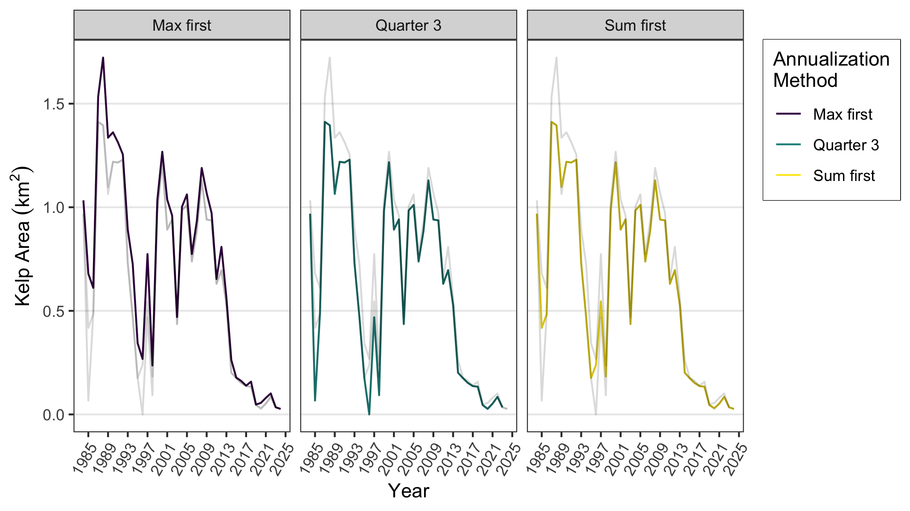

## Data setup and prerequisites

Install the `KelpAreaIndicator` package from the SCCWRP github repository and load it.


``` r
# devtools::install_github("SCCWRP/KelpAreaIndicator")
library(KelpAreaIndicator)
```

Provide the file paths to the Landsat kelp area data, downloaded from the [EDI Data Portal](https://portal.edirepository.org/nis/mapbrowse?scope=knb-lter-sbc&identifier=74), and the shapefile that defines the kelp segment polygons of interest. The kelp segments shapefile is a polygon shapefile with at least one attribute, `Segment_ID`, that defines the kelp area segments of interest.


``` r
lter_file_path <- "../data/LandsatKelpBiomass_2023_Q3_withmetadata.nc"
kelp_segments_file_path <- "../data/uswc_2023_v1"
```

## Assigning segments to Landsat pixels

The `segment_landsat_data()` function will load the Landsat netCDF file and assign each pixel to its respective segment, defined in the kelp segments shapefile. The resulting data frame consists of rows of pixels from the Landsat data, and columns of quarters for each year of the time series. The `Segment_ID` column indicates which segment that the pixel belongs to. The `lon` and `lat` columns are the longitude and latitude of the pixel, respectively. The remaining columns represent the quarterly kelp area time series of that pixel, in m^2.


``` r
segmented_landsat_data <- segment_landsat_data(
  lter_file_path = lter_file_path,
  kelp_segments_file_path = kelp_segments_file_path
)
#> Reading layer `uswc_2023_v1' from data source 
#>   `/Users/nicholasl/Documents/Projects/kelp/KelpAreaIndicator/data/uswc_2023_v1' 
#>   using driver `ESRI Shapefile'
#> Simple feature collection with 360 features and 1 field
#> Geometry type: MULTIPOLYGON
#> Dimension:     XY
#> Bounding box:  xmin: -124.844 ymin: 32.50006 xmax: -117.1239 ymax: 48.42642
#> Geodetic CRS:  WGS 84

segmented_landsat_data
#> # A tibble: 368,087 × 162
#>    Segment_ID   lon   lat Q1.1984 Q2.1984 Q3.1984 Q4.1984 Q1.1985 Q2.1985
#>    <chr>      <dbl> <dbl>   <int>   <int>   <int>   <int>   <int>   <int>
#>  1 OR_21      -125.  42.8      NA       0      66      NA      NA       0
#>  2 OR_21      -125.  42.8      NA       0       0      NA      NA       0
#>  3 OR_21      -125.  42.8      NA       0       0      NA       0       0
#>  4 OR_21      -125.  42.8      NA       0     153      NA      NA       0
#>  5 OR_21      -125.  42.8      NA       0       0      NA       0       0
#>  6 OR_21      -125.  42.8      NA       0       0      NA       0       0
#>  7 OR_21      -125.  42.8      NA       0       0      NA       0       0
#>  8 OR_21      -125.  42.8      NA       0       0      NA       0       0
#>  9 OR_21      -125.  42.8      NA       0      60      NA       0       0
#> 10 OR_21      -125.  42.8      NA       0       0      NA       0       0
#> # ℹ 368,077 more rows
#> # ℹ 153 more variables: Q3.1985 <int>, Q4.1985 <int>, Q1.1986 <int>,
#> #   Q2.1986 <int>, Q3.1986 <int>, Q4.1986 <int>, Q1.1987 <int>, Q2.1987 <int>,
#> #   Q3.1987 <int>, Q4.1987 <int>, Q1.1988 <int>, Q2.1988 <int>, Q3.1988 <int>,
#> #   Q4.1988 <int>, Q1.1989 <int>, Q2.1989 <int>, Q3.1989 <int>, Q4.1989 <int>,
#> #   Q1.1990 <int>, Q2.1990 <int>, Q3.1990 <int>, Q4.1990 <int>, Q1.1991 <int>,
#> #   Q2.1991 <int>, Q3.1991 <int>, Q4.1991 <int>, Q1.1992 <int>, …
```
If a kelp segment never contains any pixels with kelp coverage, these segments are represented by a single row of `NA` values for the entire time series.

``` r
segmented_landsat_data |>
  dplyr::filter(Segment_ID == "CA_103")
#> # A tibble: 1 × 162
#>   Segment_ID   lon   lat Q1.1984 Q2.1984 Q3.1984 Q4.1984 Q1.1985 Q2.1985 Q3.1985
#>   <chr>      <dbl> <dbl>   <int>   <int>   <int>   <int>   <int>   <int>   <int>
#> 1 CA_103        NA    NA      NA      NA      NA      NA      NA      NA      NA
#> # ℹ 152 more variables: Q4.1985 <int>, Q1.1986 <int>, Q2.1986 <int>,
#> #   Q3.1986 <int>, Q4.1986 <int>, Q1.1987 <int>, Q2.1987 <int>, Q3.1987 <int>,
#> #   Q4.1987 <int>, Q1.1988 <int>, Q2.1988 <int>, Q3.1988 <int>, Q4.1988 <int>,
#> #   Q1.1989 <int>, Q2.1989 <int>, Q3.1989 <int>, Q4.1989 <int>, Q1.1990 <int>,
#> #   Q2.1990 <int>, Q3.1990 <int>, Q4.1990 <int>, Q1.1991 <int>, Q2.1991 <int>,
#> #   Q3.1991 <int>, Q4.1991 <int>, Q1.1992 <int>, Q2.1992 <int>, Q3.1992 <int>,
#> #   Q4.1992 <int>, Q1.1993 <int>, Q2.1993 <int>, Q3.1993 <int>, …
```

## Annual time series
The quarterly Landsat time series is transformed to an annual time series with the `annualize_time_series()` function. We provide two methods to achieve this, `max_first` and `sum_first`, discussed below. The annualized time series data frame contains three columns for representing the annual kelp area time series:

* `area_abs`: kelp area in absolute magnitude, in km^2
* `area_hist`: kelp area relative to the historical median, expressed as a percentage
* `area_pct`: kelp area relative to the maximum occupiable kelp area, expressed as a percentage

Note that the historical median area (`historical_med`) and maximum occupiable area (`max_occupiable`) are given per `Segment_ID` as well, repeated for every row of its time series. The historical median is calculated as the median of the maximum annual kelp area, depending on the `annualization_method`, for the years 1984 to 2013, inclusive.

The `max_first` method will loop through all Landsat pixels and for each year of the time series, it will select the maximum value that that pixel attained in that year. Then, these maximum values are added together for all pixels in each segment, so that the resulting time series is annual for each kelp segment.

``` r
max_first_time_series <- annualize_time_series(
  segmented_landsat_data = segmented_landsat_data,
  annualization_method = "max_first"
)
max_first_time_series
#> # A tibble: 14,400 × 7
#>    Segment_ID max_occupiable historical_med  year area_abs area_hist area_pct
#>    <chr>               <dbl>          <dbl> <dbl>    <dbl>     <dbl>    <dbl>
#>  1 CA_1                0.800        0.00509  1984 0.000543      10.7   0.0679
#>  2 CA_1                0.800        0.00509  1985 0.00434       85.3   0.542 
#>  3 CA_1                0.800        0.00509  1986 0.0850      1671.   10.6   
#>  4 CA_1                0.800        0.00509  1987 0.0912      1793.   11.4   
#>  5 CA_1                0.800        0.00509  1988 0              0     0     
#>  6 CA_1                0.800        0.00509  1989 0.0163       320.    2.03  
#>  7 CA_1                0.800        0.00509  1990 0.0608      1195.    7.60  
#>  8 CA_1                0.800        0.00509  1991 0.0145       286.    1.82  
#>  9 CA_1                0.800        0.00509  1992 0.00619      122.    0.774 
#> 10 CA_1                0.800        0.00509  1993 0              0     0     
#> # ℹ 14,390 more rows
```

The `sum_first` method will sum the time series for all pixels in each kelp segment, so that each kelp segment has a quarterly time series. Then, the maximum for each segment within each year is selected, so that the time series is annual.


``` r
sum_first_time_series <- annualize_time_series(
  segmented_landsat_data = segmented_landsat_data,
  annualization_method = "sum_first"
)
sum_first_time_series
#> # A tibble: 14,400 × 7
#>    Segment_ID max_occupiable historical_med  year area_abs area_hist area_pct
#>    <chr>               <dbl>          <dbl> <dbl>    <dbl>     <dbl>    <dbl>
#>  1 CA_1                0.800        0.00419  1984 0.000543      13.0   0.0679
#>  2 CA_1                0.800        0.00419  1985 0.00300       71.5   0.375 
#>  3 CA_1                0.800        0.00419  1986 0.0464      1107.    5.80  
#>  4 CA_1                0.800        0.00419  1987 0.0805      1922.   10.1   
#>  5 CA_1                0.800        0.00419  1988 0              0     0     
#>  6 CA_1                0.800        0.00419  1989 0.0138       329.    1.72  
#>  7 CA_1                0.800        0.00419  1990 0.0476      1137.    5.96  
#>  8 CA_1                0.800        0.00419  1991 0.00702      168.    0.878 
#>  9 CA_1                0.800        0.00419  1992 0.00533      127.    0.666 
#> 10 CA_1                0.800        0.00419  1993 0              0     0     
#> # ℹ 14,390 more rows
```

Compare the two methods applied to the `CA_78` segment below. The `plot_time_series()` function is a convenience function to plot the time series for a particular segment. Here, we've modified it and added another `ggplot2` line layer to visualize the difference between the `max_first` and `sum_first` annualization methods.

``` r
plot_time_series(
  kelp_area_time_series = max_first_time_series, type = "absolute",
  color = "Max first", segment_id = "CA_78"
) +
  ggplot2::geom_line(
    data = sum_first_time_series |> dplyr::filter(Segment_ID == "CA_78"),
    mapping = ggplot2::aes(x = year, y = area_abs, color = "Sum first")
  ) +
  ggplot2::scale_color_manual(
    name = NULL,
    values = c("Max first" = "steelblue", "Sum first" = "firebrick")
  )
```

<div class="figure">

<p class="caption">plot of chunk time_series_plot_comparison</p>
</div>
